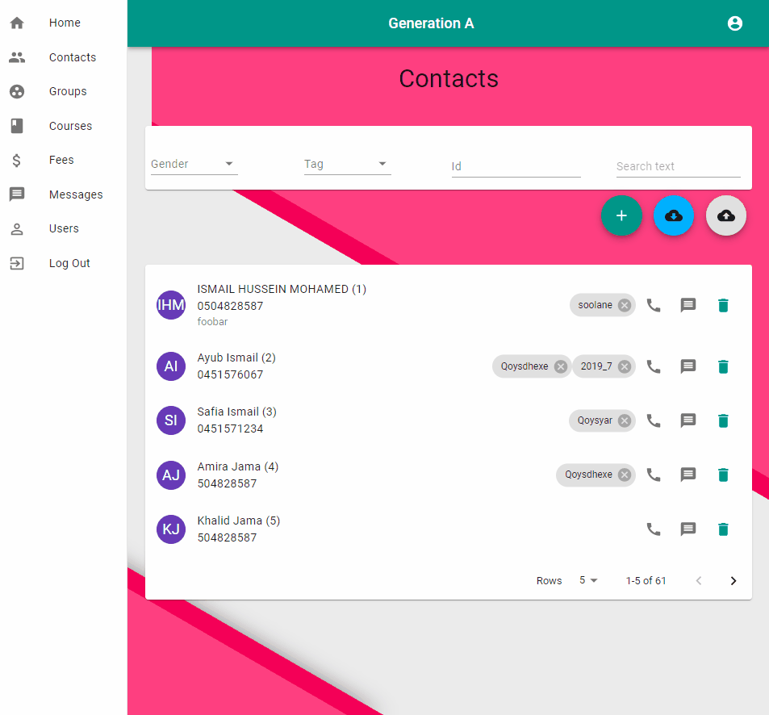
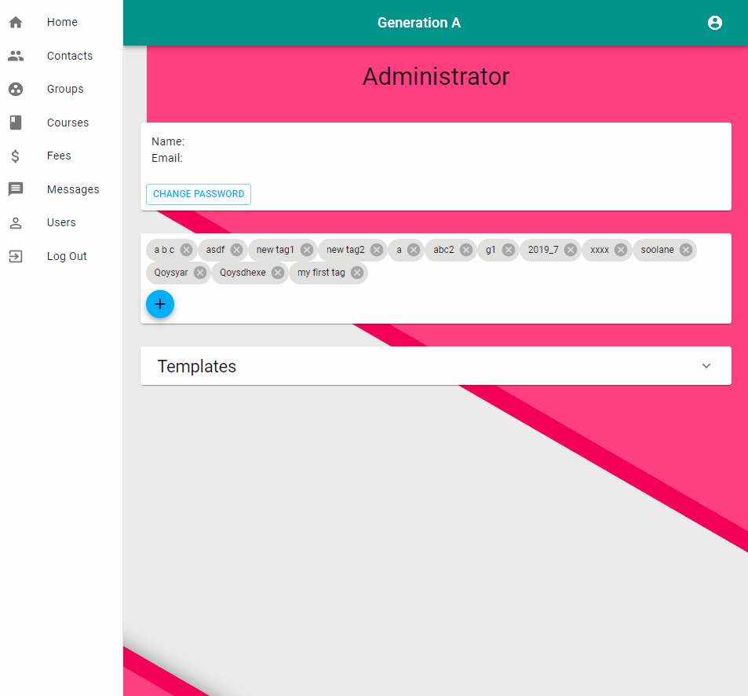

# Generation A (GenA)

## What is it?

GenA is a simple CRM application containing most fundamental features only. It's meant for small to medium schools, clubs, teaching centers, tuition centers etc.

It's meant to be simple by design and it's built mobile first in mind.

## Contacts

Contacts are the core features of the app. Contacts can be students, guardians, teachers, etc. GenA stores only basic information from each contact most notably name, gender, year of birth, phone number, family size, address, tags and notes. Only **name**, **gender** and **phone number** are required all other fields are optional.

Creating a new contact

Contacts can be filtered by gender, tag, id or a free text like name. Filter contacts is shown below.

## Tags

Tags offer a powerful and simple way to categories and manage contacts. They can be anything that you might imagine. Some example tags might be like parent, teacher, kids, boys, girls, etc.

Tags are managed under the user profile. Only administrator can change/modify tags.

Managing tags

Tags can be assigned to contacts, groups, courses and fees.

Adding tag to contact, group course or fee is shown below.

## Groups

Besides tags

## Courses

## Fees

## Messages

## Users
