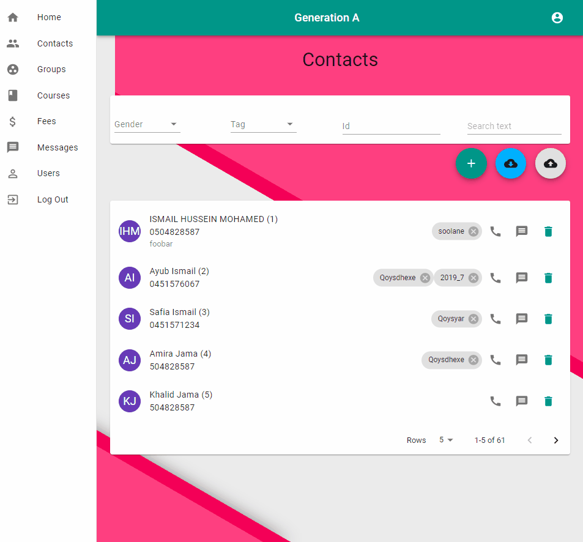

# Generation A (GenA)

## What is it?

GenA is a simple CRM application with most important core features. It's meant for small to medium schools, clubs, teaching centers, tuition centers etc.

It's meant to be simple by design and it's built mobile first in mind.

## Contacts

Contacts are the core features of the app. Contacts can be students, guardians, teachers, etc. GenA stores only basic information from each contact most notably name, gender, year of birth, phone number, family size, address, tags and notes. Only name, gender and phone number are required all other fields are optional.

Tags offer powerful and simple way to categories and manage contacts. They can be anything that you might imagine. Some example tags might be like parent, teacher, kids, boys, girls, etc.

Tags are managed under the user profile.

Creating a new contact

Managing tags

## Groups

Besides tags

## Courses

## Fees

## Messages

## Users
